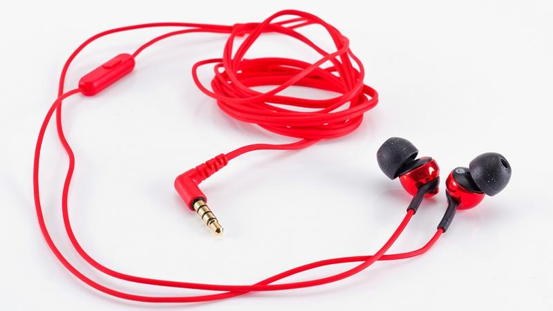
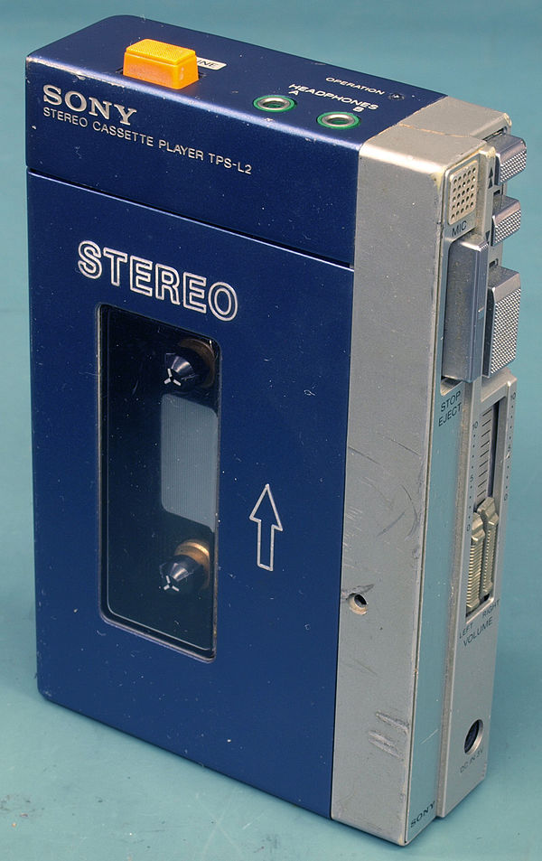
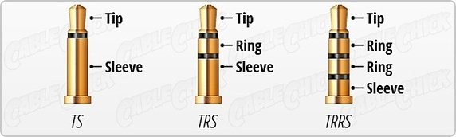
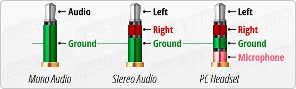
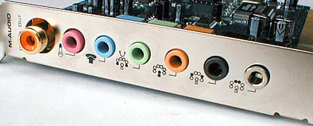
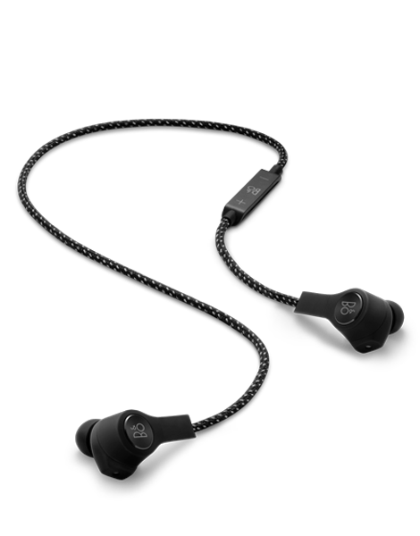
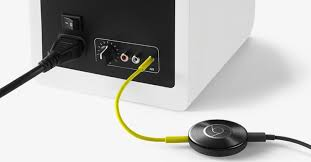

# Are we getting rid of the 3.5mm Audio Jack standard?
*The opinions expressed in this article represent purely my own and not those of my employer*

Right now some people are upset about the lack of a 3.5mm headphone jack on the new [iPhone 7](http://www.apple.com/iphone-7/) (and the [Moto Z](https://www.motorola.com/us/products/moto-z-family) before that). Many of them say that the lack of this port removes a **hundred-year-old standard** as opposed to other who claim that  this removes a **hundred-year-old technology**, neither of which represents the whole truth in my opinion. In a recent hype about reversible connectors ( [Lightning](https://en.wikipedia.org/wiki/Lightning_(connector) ) and [USB-C](https://en.wikipedia.org/wiki/USB_Type-C) ) let's take a look back at this 360° rotatable plug which seems to be leaving us.

### Definition
The components of every connector is its physical pin layout and wiring combined with the underlaying protocol used to send electrical signals over the given wires. It seems important to mention this as nowadays it is possible to update the protocol without changing the connector (e.g. [HDMI 1.0 - 2.0](https://en.wikipedia.org/wiki/HDMI) ) whereas before in the analog world the signal was "hard-wired" to the specific pins.  
The audio Jack can be used for both speakers/headphones as well a microphones as electrical signals produced by a microphone or consumed by a speaker are the same.

### History
The Audio Jack, also simply called Phone connector was [first introduced in 1878](https://en.wikipedia.org/wiki/Phone_connector_(audio)) in its original 1/4 inch (6.35mm) version. This form factor has mainly been used for manual telephone switchboards, it is however still widely used for instruments such as guitars and stage microphones as well as studio headphones. Having first been developed for the phone industry, the original Phone connector could only carry a mono audio signal. (for phones with a single microphone and a single phone handle for a single ear). 

Over the years the Phono Jack gained two other form factors, the now ubiquitous 3.5mm Jack (also called mini-Jack), which was introduced in 1964 and popularized in 1979 by the Sony Walkman, as well as the smaller version which comes in at 2.5mm (sub-miniature jack as you might remember it from early feature phones). With the usage shifting to the music industry another pin was added to be able to carry two sound signals and be able to play back music.

### electronic composition
The jack's "pluggable" and "rotatable" design made it susceptible to upgrades because it was easy to add pins/rings to the connector to carry additional signals. Nowadays this is most commonly used to have an in-line microphone and playback controls. This might now seems pretty standard but wasn't so much the case in the days of proprietary connector before the European Union tried to [standardize](http://europa.eu/rapid/press-release_MEMO-09-301_en.htm) charging ports among phone manufacturers. Before that every company shipped their phones with their own proprietary connectors [Nokia - Pop-Port](https://en.wikipedia.org/wiki/Nokia_Pop-Port), [Sony Ericsson - FastPort](https://en.wikipedia.org/wiki/FastPort), [Apple - 30-pin](https://en.wikipedia.org/wiki/Dock_connector) and [Samsung](http://pinouts.ru/CellularPhones-P-W/all_samsung_pinout.shtml). It was only after this standardization that phone companies started providing data services and charging through mini or micro-USB and used a mini-jack connector for audio, microphones and multi-media controls. This in turn pushed the development and standardization of the mini jack.

Normal three-contact mini-jacks are called *TRS* which stands for *tip-ring-sleeve* which allows for two signals (+ground) to be transmitted in parallel (e.g. stereo). Other configurations include TS (mono), TRRS (4-point) and TRRRS (5-point). Whereas most usages of the TRRS are intended for stereo+microphone/controls, there are still differences in configuration which might make some headsets work on some devices but not on others. The main difference being that the microphone signal can either be carried on the 3rd ring with ground being on the sleeve or the other way around (OMTP vs CTIA). On top of these wiring differences some companies seem to use non-standardize signals for the microphone and controls such that in the end not all headsets are compatible with all smartphones.

The specification of the TRRRS, which has only finished in 2016 and has not yet been implemented on any device, defines that the additional ring on the jack could be use to provide power from the host to the connected device to allow for applications such as active-noise cancellation without the need for an in-line battery (e.g. [Bose QC20](https://www.bose.co.uk/en_gb/products/headphones/earphones/quietcomfort-20i-acoustic-noise-cancelling-headphones.html?mc=05_PS_HP_BO_GO_&gclid=Cj0KEQiA6_TBBRDInaPjhcelt5oBEiQApPeTFzpSf-nZyL7Jt4p82xpdX4b2aDQtwxJgbsIw5vxO1e0aArxz8P8HAQ&gclsrc=aw.ds)). At this point it seems clear that we should't continue to abusse the mini-Jack by squeezing more rings onto the connector for parallel data transmission but rather use a serial signal transmission which would be more future proof and support protocol upgrades. Overall this approach has some physical limitations due to the size to the connector but also because backwards compatibility should be maintained. Over the years the TRRS configuration has been used for other interesting applications, such as USB power (iPod shuffle 4th Gen), remote shutter release (Canon's RS-60E3)  and Composite Video (Camcorders, Raspberry Pie, iPod 5th Gen). 

Another good example where one can see the misuse of the 3.5mm jack is in the case of 7.1 audio (and 5.1 for that matter) surround audio systems where up to 4 cables are needed between the computer and the peripheral to transmit all the audio signals, nowadays we largely have the possibility to combine all these signals into a single cable by using a digital signal!

### What is important for a connector
There are very different requirements for a connector depending on it's use case. Some are consumer facing such as ease of use, durability and size whereas others are producer facing such production cost and availability of compatible devices. These restrictions might also create a positive feedback loop to keep legacy technology around for longer than intended...  
At the interesting intersection between digital signals and the real world users, a connector has to be designed with things in mind such as [secure locking](https://en.wikipedia.org/wiki/DisplayPort#Technical_specifications), [trip proof power cords](https://en.wikipedia.org/wiki/MagSafe) and [reversible connectors](https://en.wikipedia.org/wiki/USB_Type-C). The mini-Jack is probably the only connector which can be rotated 360° which makes a lot of sense for a plug on devices which are always carried around in our pockets. This pin-less design also makes it very sturdy as no small parts are involved in the mechanism.

### A wireless future?
I guess everyone has a love-hate relationship with wireless connections, if they don't work it's really annoying and if they work it gives you all the cable-less freedom you ever wanted. Cables are very reliable due to the shielded transmission medium that the cables provide, which also allows the usage of a very straight forwards protocol. Wireless signals, on the other hand, have to fight against all other kinds of electro-magnetic waves in the air (its medium of transmission) all while providing the most reliable, fastest and widest range of use possible to their users. This makes wireless transmitters, receivers and protocols very complicated as they have to include mechanism for noise cancellation and error correction. After years of evolution the [Bluetooth](https://en.wikipedia.org/wiki/Bluetooth) standard with additions such as [aptX](http://www.aptx.com/) has finally come to a point where it supports *almost* lossless and *virtually* lag-free audio playback which finally makes it acceptable for high-end audio applications.

Wifi has saved us from laying cables all around the house and drilling holes through walls. Since some years we can see the same development of wireless technologies for speakers have finally freed us from using meter-long cables to send music to them; Bluetooth, [AirPlay](https://www.cnet.com/topics/speakers/best-speakers/airplay/) , [Sonos](www.sonos.com) , [Spotify Connect](https://www.spotifygear.com/) , [Google Cast](https://www.google.com/chromecast/built-in/audio/) ... And some of them also finally give us the ability to play the same music on different speakers and in different rooms without the need for any cables. Of course you can argue that this does not apply for headphones but we might be missing out on features which are just not possible right now.

One interesting point is that at some point on its way to the ears the digital audio signal has to be converted into an analog signal which, after being amplified, will power the actual driver to produce the sounds. This conversion is done by and DAC (digital-to-analog converter) which can either be located inside the device, as is the case nowadays with mini jack devices, or it has to be inside the headphone-cable which might drive up the cost of production and retail, but it would also give people the opportunity to decide how much money the audio quality is worth to them.

### Conclusion
One could say that audio signals are basic enough to be carried through an analog connection from the device to the headphones and it should stay like this, on the other hand a digital and/or wireless option would give us greater flexibility for the future!  
So as you can see, both notions of  "100-year-old standard" and "100-year-old technology" do not fully apply. Fact is that the headphone jack is used to transfer an analog signal and it is the last of its kind.
I'm looking forward to the future, where headphone and speaker innovation is lo longer blocked by a legacy analog port and cable. We are already seeing these innovation in form of battery-free noise-cancelling headphones ( [JBL Reflect Aware](https://www.jbl.com/earbuds/REFLECT+AWARE.html) [Libratone Q Adapt](https://www.libratone.com/us/products/q-adapt-in-ear) ), stereoscopic headphones  [Ossic X](https://www.ossic.com/) and even earphones with integrated stereoscopic microphones  ([Sennheiser Ambeo 3D](http://www.soundguys.com/sennheiser-ambeo-smart-surround-headphones-10937/))! Further down the line, with the advance of VR and AR taking over our field of view, we might want to integrate new ideas into the audio as well and not neglect that our ears are still one of our most important senses.

Thanks for reading, as this is my first blog post, please let me know what you think.

### links and interesting reads

[A Brief History of Killing the Headphone Jack](https://shkspr.mobi/blog/2016/06/a-brief-history-of-killing-the-headphone-jack/)

[3.5mm headphone jack differences](https://www.quora.com/What-is-the-difference-between-3-5-mm-jack-in-mobiles-and-laptops/answer/Gaurav-Rathod-3?srid=d8u0)

[Headset standards: OMTP or CTIA](http://www.ebay.com/gds/Headset-standards-OMTP-or-CTIA-/10000000176335062/g.html)
[Common external power supply - Wikipedia](https://en.wikipedia.org/wiki/Common_external_power_supply#Pending.2Ffuture_European_legislation)

[Wired Headsets: A Tutorial on Connectors, Cables & Pinouts](http://www.mgraves.org/2014/08/wired-headsets-a-tutorial-on-connectors-cables-pinouts/)

[CableChick - Understanding TRRS and Audio Jacks](http://www.cablechick.com.au/blog/understanding-trrs-and-audio-jacks/)
